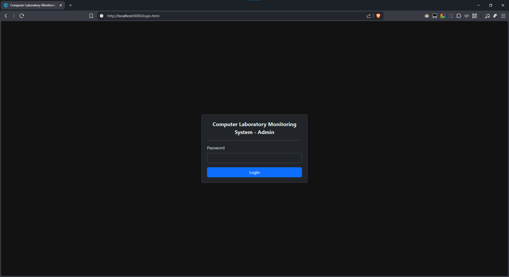
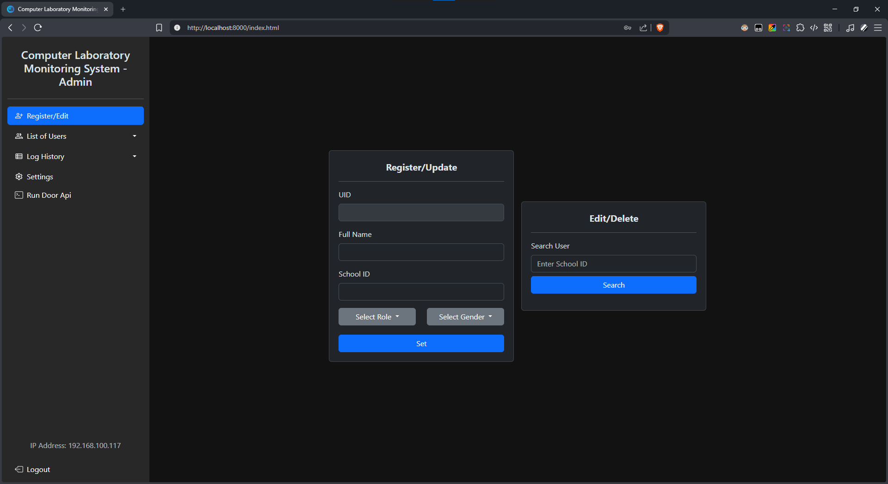
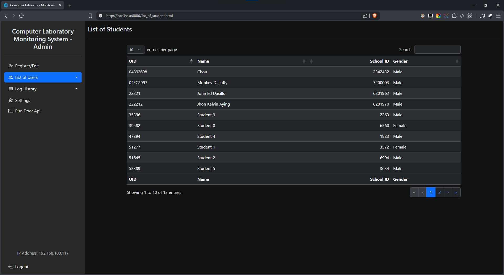
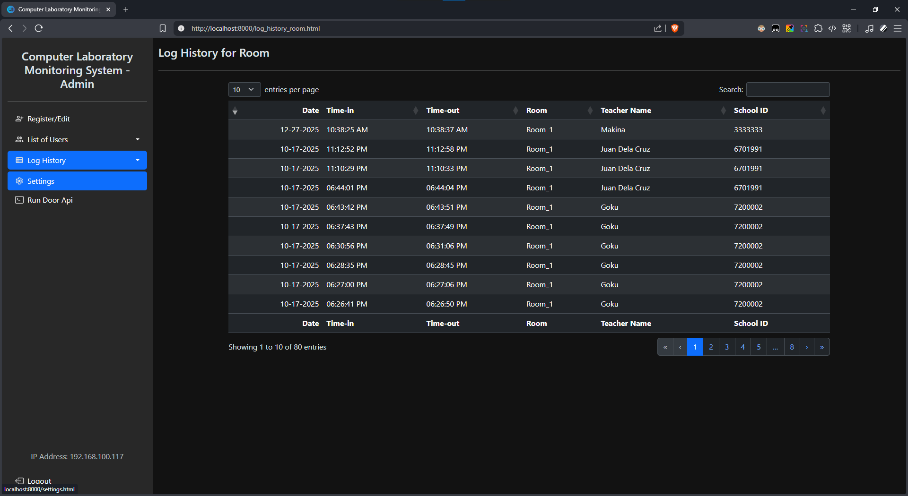
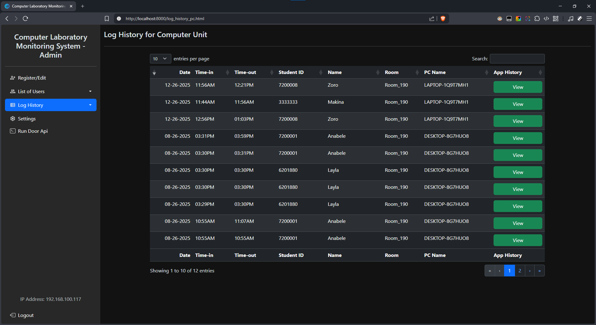
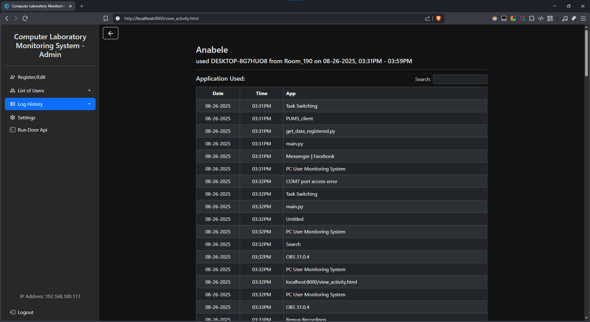

# Computer Laboratory Monitoring App

    A Windows App for Monitoring Computer Laboratorys

## Features

- Self-hosted
- Using RFID as Key
- Monitoring the App used in Computer Units
- Monitoring the Teacher used the Room

## Getting Started

### Prerequisites

- Read [this](https://github.com/Teyooooo/Computer-Laboratory-Monitoring-System)

### Installation

Download this [version v1.0.0](github.com) and move it to your <b>Drive C:</b> 

## Screenshots

